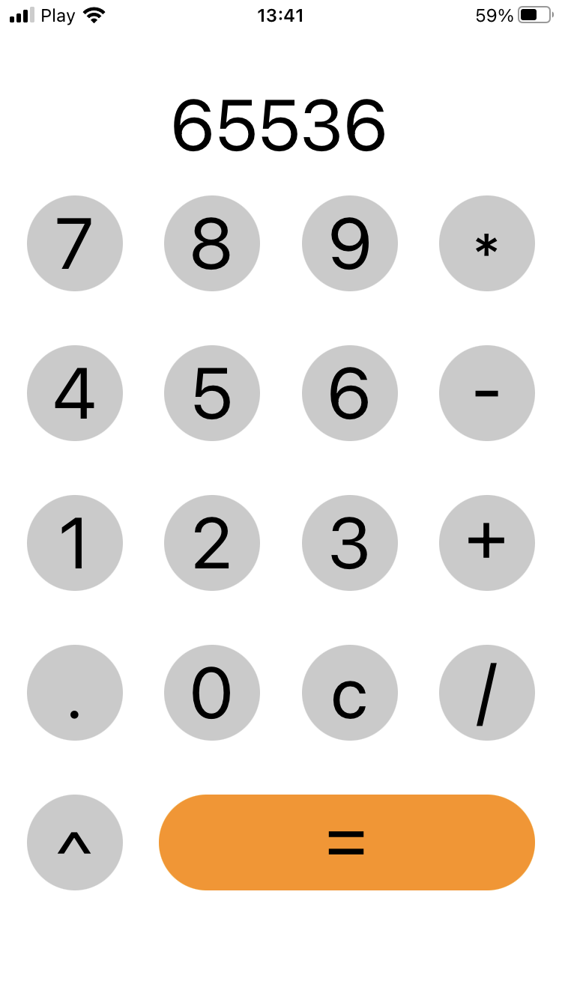
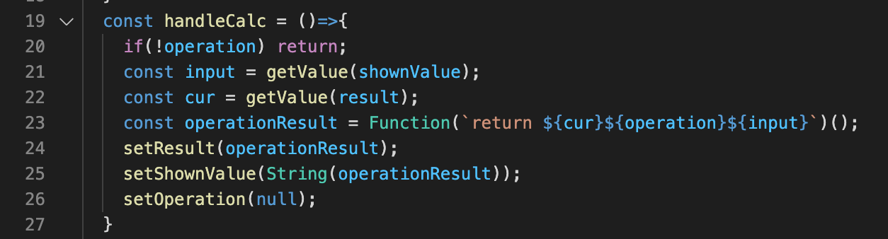

# Lab 1 - Kalkulator
## wynik

kalkulator zrobiony w React Native przy pomocy aplikacji Expo.

<h3>opis fragmentu kodu</h3>

Jest to funkcja odpowiedzialna za właściwe obliczenie wyniku (np.: po kliknięciu "=").

<ul>
    <li>Na początku jeśli operacja nie jest wybrana to funkcja od razu kończy swoje działanie.</li>
    <li>Pobiera i zapisuje w tymczasowych zmiennych wartości - obecnego wyniku oraz liczby z pola</li>
    <li>Dynamicznie tworzy funkcję, która zwraca wynik obliczeń i wywołuje ją przypisując wynik do zmiennej</li>
    <li>Ustawia obecny wynik oraz wartość w polu na obliczony wynik</li>
    <li>anuluje wybór operacji do wykonania</li>
</ul> 
